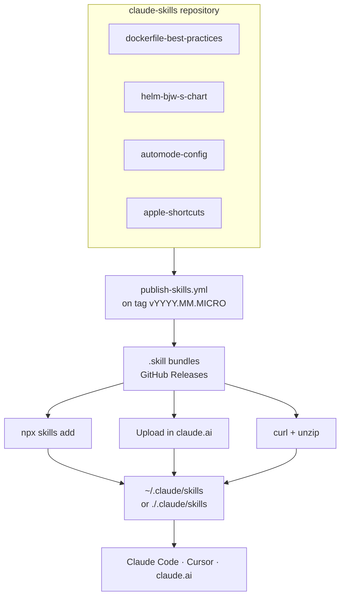

# 🤖 Claude Agent Skills Stack

**Self-contained skills for autonomous AI agents.**
Each skill bundles the instructions, validators, and reference material an
agent needs to do one job well, with no dependency on the others.

[Installation](#-installation) • [Skills](#-available-skills) • [Quick start](#-quick-start) • [Development](#-development) • [Architecture](#-architecture)

---

## 🎯 Available skills

| Skill | Version | What it does | Highlights |
|---|---|---|---|
| [**dockerfile-best-practices**](./skills/dockerfile-best-practices/) | 3.2.0 | Create and optimize Dockerfiles and Compose files | BuildKit syntax, cache mounts, non-root users, 30+ analyzer rules, DCLint interop |
| [**helm-bjw-s-chart**](./skills/helm-bjw-s-chart/) | 5.4.0 | Generate production Helm charts on the bjw-s common library | app-template v5 (v4 legacy), sidecars, init containers, HPA, ServiceMonitor |
| [**automode-config**](./skills/automode-config/) | 0.7.1 | Author, validate, and migrate project-level `autoMode` blocks | Four official sections, critique gate, sha256 hash gate, atomic flock writes |
| [**apple-shortcuts**](./skills/apple-shortcuts/) | 1.0.0 | Generate importable Apple Shortcuts for macOS and iOS | Native and third-party action catalogs, validator, inspector, App Intents discovery |

## ⚡ Quick start

Skills are discovered automatically once installed. Ask in plain language:

```text
"Create a Dockerfile for my Python FastAPI application"
"Generate a Helm chart for this container image"
"Analyze my Dockerfile for best practices"
"Set up Claude Code autoMode for this project"
```

Or drive the validators directly. `uv run` reads each script's
[PEP 723](https://peps.python.org/pep-0723/) header and prepares the
environment, so there is no `pip install` step:

```bash
# Analyze a Dockerfile, then a Compose file
uv run skills/dockerfile-best-practices/scripts/analyze_dockerfile.py ./Dockerfile
uv run skills/dockerfile-best-practices/scripts/analyze_compose.py ./compose.yaml

# Validate a Helm chart
uv run skills/helm-bjw-s-chart/scripts/validate_chart.py ./my-chart/

# Inspect autoMode state, then scan for adoption candidates
uv run skills/automode-config/scripts/inspect_automode.py
uv run skills/automode-config/scripts/scan_project.py
```

`automode-config` also ships a natural-language slash command:

```text
/automode-edit add a hard_deny rule that forbids pushing to main
/automode-edit allow deploys to the staging namespace
/automode-edit drop the soft_deny entry about npm install
```

The agent interprets the query, builds a full four-section proposal, shows a
diff, and commits through `apply_automode.py` behind the critique gate, the
hash gate, and an atomic flock-protected write. Full contract:
[`commands/automode-edit.md`](./skills/automode-config/commands/automode-edit.md).

---

## 📦 Installation

### Recommended: the `skills` CLI

The [`skills`](https://skills.sh/) CLI resolves any GitHub repo and wires the
bundles into the right agent directories (Claude Code, Cursor, and others).
Run it via `npx`, no global Node install required.

```bash
# Interactive: pick scope and agents
npx skills add obeone/claude-skills

# All skills, user-global (~/.claude/skills)
npx skills add obeone/claude-skills -g --all

# All skills, current project (./.claude/skills)
npx skills add obeone/claude-skills --all

# A single skill (project-scoped; add -g for global)
npx skills add obeone/claude-skills --skill dockerfile-best-practices -y

# List what the repo offers without installing
npx skills add obeone/claude-skills -l
```

Update with `npx skills update`, remove with `npx skills remove`, inspect with
`npx skills list`. Full options: `npx skills -h`.

### Claude.ai (web)

1. Download the `.skill` bundles from [Releases](../../releases)
2. Go to **Settings** then **Skills**
3. Click **Upload skill** and select each `.skill` file

### Manual, from a release bundle

For hosts where Node is not an option:

```bash
mkdir -p ~/.claude/skills

for skill in dockerfile-best-practices helm-bjw-s-chart automode-config apple-shortcuts; do
  curl -L "https://github.com/obeone/claude-skills/releases/latest/download/${skill}.skill" \
    -o /tmp/skill.zip && unzip -o /tmp/skill.zip -d ~/.claude/skills/
done
```

Swap `~/.claude/skills/` for `.claude/skills/` to install project-scoped.

### From source

```bash
git clone https://github.com/obeone/claude-skills.git
cp -r claude-skills/skills/* ~/.claude/skills/
```

### Other platforms

The `skills` CLI auto-detects supported agents; pass `--agent <name>` to target
one specifically (for example `--agent cursor`). For an unsupported agent,
extract the `.skill` bundle into that agent's skills directory.

> **How it works:** skills are packaged by
> [Skill Pack](https://github.com/NimbleBrainInc/skill-pack) on every release.
> The action builds `.skill` bundles (ZIP archives) and uploads them to the
> GitHub release.

---

## 🧩 Skill anatomy

Every skill follows the same layout, so an agent that knows one knows them all:

| Path | Role |
|---|---|
| `SKILL.md` | Entry point. YAML front-matter (`name`, `description`, `metadata.version`) plus the procedure. Deliberately short: it stays in the agent's context for the whole session. |
| `scripts/` | Python validators and analyzers, dependencies declared inline via PEP 723. |
| `references/` | Deep-dive documentation, loaded on demand rather than upfront. |
| `assets/` | Templates, fixtures, and boilerplate. |
| `commands/` | Slash-command definitions, when the skill ships one. |

### Design principles

| Principle | What it means here |
|---|---|
| **Self-contained** | A skill bundles everything it needs and never depends on another skill. |
| **Progressive disclosure** | `SKILL.md` carries the procedure; detail lives in `references/`. Context is a recurring cost, so the entry point stays small. |
| **Validation-first** | Every skill ships scripts that verify its own output. |
| **Modern tooling** | BuildKit, Compose V2, Helm v3, bjw-s v5, Python via `uv`. |

---

## 🔍 What each skill covers

### dockerfile-best-practices

- **Language templates**: Python/uv, Node.js, Go, Rust, PHP, Debian
- **Security patterns**: non-root users (UID/GID above 10000), secret mounts, SBOM and provenance attestations
- **Performance**: cache mounts, multi-stage builds, layer ordering
- **Static analyzer**: 30+ rules, including defects a green build never reveals (a `--chown` silently discarded to root, a healthcheck calling a binary the image does not ship)
- **Compose support**: V2 practices (no `version:` field, runtime hardening, `container_name:` only where you will never `--scale`)
- **Linting, ours and everyone else's**: where `docker build --check`, hadolint, [DCLint](https://github.com/zavoloklom/docker-compose-linter) and this repo's analyzers overlap, and where each is the only tool that catches a given defect
- **Compose file naming**: all four names Compose V2 accepts are valid, so the skill matches whatever the project already uses, asks once when there is no precedent, and remembers the answer

### helm-bjw-s-chart

- **bjw-s common library**: app-template v5 patterns, with v4 legacy support
- **Complete chart structure**: Chart.yaml, values.yaml, common loader, NOTES.txt
- **Deployment patterns**: single container, sidecars, init containers, multi-controller, StatefulSets
- **Beyond the basics**: HorizontalPodAutoscaler, ServiceMonitor/PodMonitor, NetworkPolicy
- **common 5.1.0**: DaemonSet `updateStrategy`, `automountServiceAccountToken` on the ServiceAccount, cross-namespace Routes with an auto-generated `ReferenceGrant`, `maxSurge` / `maxUnavailable` replacing the deprecated `surge` / `unavailable`
- **Compose to Helm**: key-by-key mapping from a `compose.yaml` service to bjw-s values
- **Chart validator**: structure, bjw-s compatibility, dangling references, and schema-invalid shapes

### automode-config

- **The four official sections**: `environment`, `allow`, `soft_deny`, `hard_deny`, all arrays of prose rules with a per-section `$defaults` sentinel. There is no `ask` bucket and no plain `deny` bucket; those belong to `permissions`, and mixing them up is the mistake this skill exists to prevent.
- **Critique-gated writes**: `claude auto-mode critique` runs once per commit. A zero exit is necessary but not sufficient, because the binary sometimes exits 0 having produced no critique at all; an empty or degenerate critique fails the commit too. Raw output is archived per run.
- **Atomic and reversible**: per-file flock, `O_EXCL` write, five rolling backups, sha256 commit predicate.
- **Capability auto-detection**: swaps `~/.claude/settings.json` transiently when the CLI lacks `--settings`, with signal-handler restore.
- **Recovery**: `--repair` reclaims stale flocks and restores `.preview-orig` orphans.
- **Requires** Claude Code 2.1.83+.

### apple-shortcuts

- **Importable output**: `.shortcut` and plist XML for macOS and iOS
- **Action catalogs**: native actions plus common third-party apps
- **Tooling**: validator, inspector, and App Intents discovery

---

## 🔨 Development

### Repository structure

```text
.
├── README.md             # This file
├── CLAUDE.md             # Claude Code guidance for this repo
├── AGENTS.md             # Agent guidelines
├── .github/workflows/    # CI and release automation
└── skills/
    ├── dockerfile-best-practices/
    ├── helm-bjw-s-chart/
    ├── automode-config/
    └── apple-shortcuts/
```

### Mandatory requirements

1. **`SKILL.md` front-matter** carries `name`, `description`, and
   `metadata.version`:

   ```yaml
   ---
   name: my-skill
   description: "Skill description"
   metadata:
     version: "1.0.0"
   ---
   ```

2. **POSIX text**: every file ends with a newline (`\n`) and uses LF endings.
3. **Python via `uv`**, with dependencies declared inline (PEP 723).

### Workflows

| Workflow | Trigger | Purpose |
|---|---|---|
| `validate-skills.yml` | PRs, push to `main` | Validate front-matter and bundle structure |
| `publish-skills.yml` | Tag push (`v*`) | Pack skills, create the release, upload the bundles |

### Versioning

Two version spaces, deliberately decoupled:

| Space | Scheme | Example | Meaning |
|---|---|---|---|
| Per-skill `metadata.version` | SemVer | `3.1.0` | Changes to that one skill |
| Repo release tag | CalVer | `v2026.08.0` | A publish happened, nothing more |

Cut a release by picking the next micro for the current month, then pushing an
annotated signed tag:

```bash
git tag -s "v$(date +%Y.%m).0" -m "Publish skills"
git push origin "v$(date +%Y.%m).0"
```

### Adding a skill

1. Create `skills/<skill-name>/SKILL.md` with the required front-matter
2. Add `scripts/` with validators and analyzers
3. Add `references/` with the deep-dive documentation
4. Add `assets/` with templates if the skill needs them
5. Open a PR; `validate-skills` checks the structure

### Migration note: `helm-chart-generator` became `helm-bjw-s-chart` (v3.0.0)

The skill was renamed to make its scope explicit: it targets the `bjw-s`
common library, not generic Helm charts.

| Before (<= v2.x) | After (>= v3.0.0) |
|---|---|
| `skills/helm-chart-generator/` | `skills/helm-bjw-s-chart/` |
| `helm-chart-generator.skill` | `helm-bjw-s-chart.skill` |
| `~/.claude/skills/helm-chart-generator/` | `~/.claude/skills/helm-bjw-s-chart/` |

```bash
npx skills remove helm-chart-generator -g -y
npx skills add obeone/claude-skills -g --skill helm-bjw-s-chart -y
```

Anything still pointing at the old name breaks on the next install or refresh.

---

## 🏗️ Architecture



---

## 📄 License

MIT. See [LICENSE](LICENSE).

## 🙏 Credits

- [bjw-s common library](https://github.com/bjw-s/helm-charts) for the Helm chart patterns
- [astral-sh/uv](https://github.com/astral-sh/uv) for Python dependency management
- [Docker BuildKit](https://docs.docker.com/build/buildkit/) for modern build features
- [Skill Pack](https://github.com/NimbleBrainInc/skill-pack) for bundle packaging

---

*Built with 🤖 by autonomous agents, for autonomous agents.*
The skills, the validators, and most of this documentation are written by
coding agents; a human reviews and ships.

Made by Grégoire Compagnon ([obeone](https://github.com/obeone))
