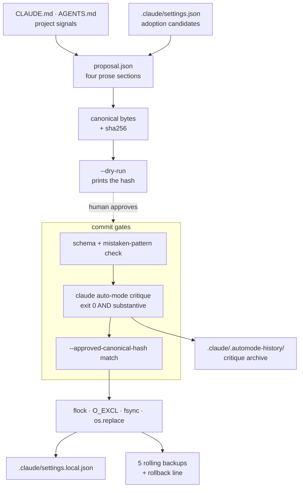

# automode-config

A Claude Code skill that authors, validates, and migrates project-level
`autoMode` permission blocks. It models the four official autoMode sections,
gates every write behind `claude auto-mode critique`, and writes atomically
under a per-file flock with a sha256 hash gate.

Primary target: `.claude/settings.local.json` (per-user-per-project,
gitignored, read by the classifier). The skill **reads** the user baseline
(`~/.claude/settings.json`) and the shared project file
(`.claude/settings.json`) for adoption candidates, but never writes to either
silently.

> **Source of truth:** `references/automode_doc_bible.md` is the distilled
> reference this skill aligns with. When the docs and the code disagree, the
> bible wins; fix the code.

---

## 🚀 Features

| Feature | What you get |
|---|---|
| 🧱 **Four-section schema** | Only `environment`, `allow`, `soft_deny`, `hard_deny` are accepted. Legacy `deny` migrates to `soft_deny`; `ask` is dropped with a warning. |
| 🔐 **Critique gate** | `claude auto-mode critique` runs once per commit, and a zero exit is not enough on its own (see below). Raw output archived per run. |
| 🧮 **Hash gate** | A `--dry-run` prints the canonical sha256; the commit only proceeds if you hand that exact hash back. |
| 💾 **Atomic and reversible** | Per-file flock, `O_EXCL` write, `os.replace`, five rolling backups, rollback line printed at the end. |
| 🔎 **Adoption scan** | Reads the shared and user files plus project signals to propose rules you already implied elsewhere. |
| 🩹 **Recovery** | `--repair` reclaims stale flocks and restores orphaned `.preview-orig.<pid>` sentinels. |
| 💬 **Natural language** | `/automode-edit <query>` drives the whole pipeline from a sentence. |

## 🤔 Why

`autoMode` configures the classifier that gates tool calls when you are in
`auto` permission mode. Hand-editing that JSON goes wrong in predictable ways:

- It is easy to land a rule under a section that does not exist, like `ask` or
  the legacy `deny`. The official four are `environment`, `allow`, `soft_deny`,
  `hard_deny`.
- The `$defaults` sentinel is per-section. Drop it from one section and you
  silently lose Anthropic's curated baseline for that section, including the
  built-in `soft_deny` rules for force-push, `curl | bash`, and production
  deploys.
- It is tempting to write `Bash(...)` patterns. Those are `permissions` syntax,
  not `autoMode`. autoMode rules are prose ("Pushing to feature branches is
  allowed: ...").
- The shared file `.claude/settings.json` ignores `autoMode` for permission
  classification, and nothing warns you about the mismatch.
- `claude auto-mode critique` is the canonical validation gate, but its CLI has
  version-dependent quirks: no `--settings` on older builds, drifting section
  headers, and an exit code of 0 even when it produced no critique at all.

The skill folds all of that into one pipeline with reproducible canonical
bytes, so applying or migrating a block is a command instead of five careful
manual steps.

---

## 📦 Installation

### Recommended: the `skills` CLI

```bash
# User-global (available in every project)
npx skills add obeone/claude-skills -g --skill automode-config -y

# Project-scoped (./.claude/skills)
npx skills add obeone/claude-skills --skill automode-config -y
```

Update with `npx skills update automode-config`, remove with
`npx skills remove automode-config`.

### Other routes

Uploading in claude.ai, unpacking a release bundle by hand, or installing
from a source checkout are covered in the repository
[Installation](../../README.md#-installation) section.

> **Provenance:** every `.skill` bundle is built in CI by
> [Skill Pack](https://github.com/NimbleBrainInc/skill-pack) from a signed
> release tag, then uploaded by the workflow itself. No asset is ever
> hand-built or hand-uploaded.

### Verify

```bash
head -5 ~/.claude/skills/automode-config/SKILL.md
# expect: name: automode-config, then metadata.version: 0.7.1 (or higher)
```

### Requirements

| Requirement | Why |
|---|---|
| **Claude Code 2.1.83+** | Auto mode itself. The docs do not pin a separate version for `hard_deny`. |
| **`uv`** on `$PATH` ([install](https://astral.sh/uv/)) | Each script declares its dependencies inline as a [PEP 723](https://peps.python.org/pep-0723/) header, so there is no `pip install` step. |
| **`claude`** on `$PATH` | The critique gate. Override the path with `CLAUDE_CLI_BIN=/path/to/claude`. |

---

## ⚙️ Usage

Three entry points; `uv run` resolves their dependencies on first invocation.

| Command | Purpose |
|---|---|
| `inspect_automode.py` | Report what the three settings files currently say |
| `inspect_automode.py --show-drift` | Compare against the approved cache; exit 6 on drift |
| `scan_project.py` | Surface adoption candidates and trust signals |
| `apply_automode.py --dry-run` | Print the canonical bytes and the sha256 to use as the gate |
| `apply_automode.py --approved-canonical-hash <sha256>` | Commit behind the critique gate and the hash gate |
| `apply_automode.py --repair` | Reclaim stale flocks, restore stranded state |

```bash
# Look before you write.
uv run skills/automode-config/scripts/inspect_automode.py
uv run skills/automode-config/scripts/scan_project.py

# Dry-run a proposal; this prints the canonical sha256.
uv run skills/automode-config/scripts/apply_automode.py \
  --proposal proposal.json --mode fresh --dry-run

# Commit. The hash from the dry-run is the gate predicate.
uv run skills/automode-config/scripts/apply_automode.py \
  --proposal proposal.json --mode fresh \
  --approved-canonical-hash <sha256-from-dry-run>
```

A minimal proposal. Every value is a prose string, never a `Tool(...)` pattern:

```json
{
  "autoMode": {
    "environment": [
      "$defaults",
      "Source control: github.com/acme-corp and all repos under it."
    ],
    "allow": ["$defaults"],
    "soft_deny": [
      "$defaults",
      "Never run database migrations outside the migrations CLI."
    ],
    "hard_deny": [
      "$defaults",
      "Never force-push to main or release/* branches."
    ]
  }
}
```

The agent-driven flow lives in `SKILL.md`: the calling agent reads `CLAUDE.md`
and `AGENTS.md`, applies judgment, and emits the proposal JSON that goes
through the same pipeline.

### 💬 One-shot edits in plain language

```text
/automode-edit add a hard_deny rule that forbids pushing to main
/automode-edit allow deploys to the staging namespace
/automode-edit drop the soft_deny entry about npm install
```

The agent interprets the query, builds a full four-section proposal, runs the
dry-run to compute the hash, shows a diff for confirmation, and commits behind
the hash gate. The same deterministic guards apply: schema validation,
mistaken-pattern detection, critique gate, flock, atomic write. Full contract
in [`commands/automode-edit.md`](./commands/automode-edit.md).

---

## 🚦 The critique gate has two layers

**Mandatory and version-agnostic.** The critique must actually say something.
Exit code 0 is necessary but not sufficient, because the binary has been
observed exiting 0 after printing nothing but:

```text
Analyzing your auto mode rules…

No critique was generated. Please try again.
```

That means the proposal was never reviewed, so it must not open the hash gate.
An empty, too-short, or explicitly degenerate critique fails the commit with
exit 3. The raw output is archived first, so the evidence survives the
failure. `--allow-empty-critique` overrides.

**Opt-in and brittle.** `--strict-critique-sections` asserts the exact set of
`##` headers. The binary renames its sections across versions, so this stays
off by default.

---

## 🧭 Out of scope

- Multi-project orchestration. The skill operates on the cwd's project only.
- Auto-`chmod` of a pre-existing `~/.claude/settings.json` at mode 0644.
  Warn-only; you fix it yourself if you agree.
- A `--lint` mode for the non-`autoMode` sections of `.claude/settings.json`.
  This skill is autoMode-only.
- Retry-on-network-failure. You re-run.

## 📚 Deeper documentation

`SKILL.md` is deliberately short: it stays in the agent's context for the whole
session and is re-read as cache on every API call, so its size is a recurring
cost. It carries the procedure and the invariants; everything below is loaded
on demand.

| Reference | Read it when |
|---|---|
| `references/automode_doc_bible.md` | The schema or the classifier's semantics is in question |
| `references/cli.md` | You need a flag, an exit code, or the critique gate layers |
| `references/mental_model.md` | You want the full six-phase flow and decision tree |
| `references/three_files.md` | A per-file mode, gotcha, or precedence question comes up |
| `references/migration.md` | Adopting existing rules, or picking a `--migrate-strategy` |
| `references/critique_workflow.md` | The critique misbehaves, drifts, or the swap-file path triggers |
| `references/canonicalization.md` | Byte-level output, fixtures, or `__example_only` |
| `references/recovery.md` | A write failed, or you need rollback and `--repair` |
| `references/verification.md` | You are checking acceptance predicates |

## 🧪 Tests

```bash
cd skills/automode-config
uv run --with pytest pytest tests/ -q    # 209 cases
```

---

## 🏗️ Architecture



---

## 📝 Status

`metadata.version: 0.7.1`, pre-1.0. The pipeline and the CLI surface are
stable; what keeps it below 1.0 is the critique binary itself, whose output
contract still shifts between Claude Code releases.

## 📄 License

MIT. See the repository [LICENSE](../../LICENSE).

---

*Built with 🤖 by autonomous agents, for autonomous agents.*

Made by Grégoire Compagnon ([obeone](https://github.com/obeone))
