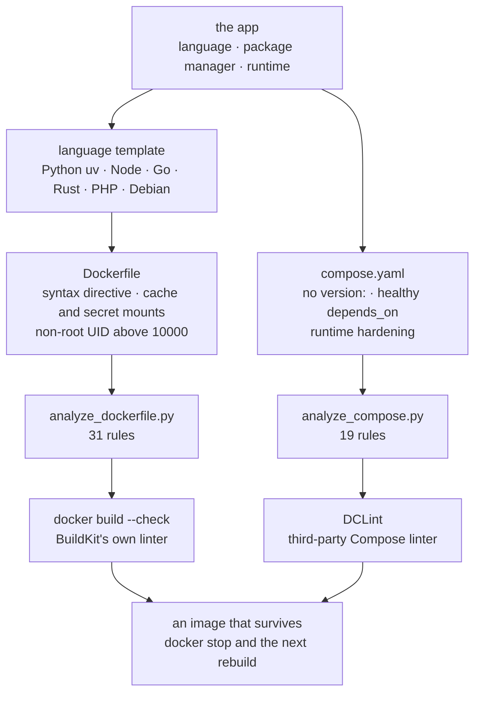

# dockerfile-best-practices

A Claude Code skill that writes and optimizes Dockerfiles with modern
BuildKit features (multi-stage builds, cache mounts, secret mounts,
non-root users), and analyzes existing Dockerfiles and Compose files for
anti-patterns.

It ships six language templates and two static analyzers covering the
most common Docker and Compose mistakes.

> **v3.0.0 was a breaking release.** It reverses the old "pin the
> runtime, never the OS" doctrine, retires the two analyzer rules that
> enforced it, and inverts a third. Read [`CHANGELOG.md`](./CHANGELOG.md)
> before upgrading if your CI asserts on rule ids.

---

## 🚀 Features

| Feature | What you get |
|---|---|
| 📏 **Eleven essential rules** | BuildKit syntax directive, a pinned readable tag, cache mounts per package manager (pip, npm, yarn, go, cargo, composer, maven), APT cache setup, `--mount=type=secret`, non-root UID/GID above 10000, `COPY` for local files and `ADD --checksum` for remote ones, user creation before the first `COPY --chown` naming it, OCI labels, `HEALTHCHECK`, `.dockerignore`. |
| 🧬 **Six language templates** | Python (with `uv`), Node.js, Go and Rust (multi-stage to distroless), PHP with Composer, Debian base with APT cache. Each bundles the full ruleset and is linted in CI against the skill's own analyzer. |
| 🐙 **Compose V2 ruleset** | No `version:`, no `container_name:`, no `links:`, pinned tags, `depends_on` with `condition: service_healthy`, plus runtime hardening (`read_only`, `cap_drop`, `no-new-privileges`, `init`). |
| 🔎 **Two static analyzers** | 31 Dockerfile checks, 19 Compose checks. Findings carry a severity and a stable rule id that points back at the rule it violated. |
| 🩺 **PID 1 and signals** | Why a shell-form `CMD` makes your container ignore `docker stop` for the entire grace period, and the three ways out in preference order. |
| 🔗 **Linter interop** | Where these rules overlap with `docker build --check` and [DCLint](https://github.com/zavoloklom/docker-compose-linter), and where each tool is the only possible net. |

## 🤔 Why

Hand-writing a production-grade Dockerfile means juggling a long
checklist: the BuildKit syntax directive, cache mounts per package
manager, `--mount=type=secret` instead of `ARG SECRET`, a non-root user
at UID/GID above 10000, creating that user *before* the first
`COPY --chown` that names it, a `HEALTHCHECK` that calls a binary the
image actually ships. Most images get one or two of those right and
quietly miss the rest.

It also means resisting advice that sounds right and is not. "Receives
security patches" and "reproducible" are properties of a process, not of
a tag string: a floating tag patches nothing on its own, it patches when
someone rebuilds. So this skill tells you to pin a readable tag as
specific as you are willing to maintain, and says plainly that every tag
is mutable, rather than implying the tag protects you. Pinning the OS
(`python:3.12-slim-bookworm`, `alpine:3.19`) is a legitimate stability
choice and is not flagged. `:latest` and untagged images stay rejected,
because they carry zero information about what you are running. Digests
get one honest paragraph as an option with a real tradeoff: they are the
strongest guarantee available, and without renewal automation a digest is
just a tag that rots silently while you ship known CVEs feeling safe.

Compose V2 adds its own footguns: a stale `version:` field that warns on
every run, `container_name:` that blocks scaling, a bare `depends_on`
that does not actually wait for the upstream to be healthy.

Some rules exist because no other tool catches what they catch. The worst
bug this skill ever shipped was a `COPY --chown` naming a user created
later in the same stage: the modern BuildKit frontend does not fail on
that, it silently drops the `--chown` and copies the files as root. The
build stays green, `docker build --check` sees nothing, and the image
only breaks on the first runtime write. A static rule is the only
possible net.

---

## 📦 Installation

The [`skills`](https://skills.sh/) CLI resolves the repo and drops the
bundle into the right agent directory. Run it via `npx`, no global Node
install required.

```bash
# User-global (available in every project)
npx skills add obeone/claude-skills -g --skill dockerfile-best-practices -y

# Project-scoped (./.claude/skills)
npx skills add obeone/claude-skills --skill dockerfile-best-practices -y
```

Update with `npx skills update dockerfile-best-practices`, remove with
`npx skills remove dockerfile-best-practices`. Full options:
`npx skills -h`.

Uploading in claude.ai, unpacking a release bundle by hand, or installing
from a source checkout are covered in the repository
[Installation](../../README.md#-installation) section.

> **Provenance:** every `.skill` bundle is built in CI by
> [Skill Pack](https://github.com/NimbleBrainInc/skill-pack) from a signed
> release tag, then uploaded by the workflow itself. No asset is ever
> hand-built or hand-uploaded.

### Requirements

| Requirement | Why |
|---|---|
| **Claude Code**, or any agent that reads `SKILL.md` | Runs the skill. |
| **`uv`** on `$PATH` ([install](https://astral.sh/uv/)) | `analyze_compose.py` parses YAML and declares that dependency inline as a [PEP 723](https://peps.python.org/pep-0723/) header, so `uv run` resolves it with no `pip install` step. `analyze_dockerfile.py` is standard library only. |
| **Docker with BuildKit** (23+ enables it by default) | Only needed to actually build the generated Dockerfiles. |

---

## ⚙️ Usage

Ask Claude to write or review a Dockerfile and the skill auto-triggers.
The two analyzers are also standalone commands:

```bash
# Analyze an existing Dockerfile for anti-patterns
uv run skills/dockerfile-best-practices/scripts/analyze_dockerfile.py ./Dockerfile

# Analyze a Compose file (V2 compliance + service-level rules)
uv run skills/dockerfile-best-practices/scripts/analyze_compose.py ./compose.yaml
```

Each finding carries a severity (error, warning, info) and a stable rule
id, and names the `SKILL.md` rule that was violated. Rule ids are never
reused: a retired id stays retired, so an id in an old report always
means the same thing.

Neither analyzer replaces BuildKit's own linter. Run both:
`docker build --check` catches things these rules deliberately do not
duplicate, and `references/build_checks.md` maps the overlap. On the
Compose side the counterpart is
[DCLint](https://github.com/zavoloklom/docker-compose-linter); run
`docker compose config --quiet` first for schema validation, then both
linters. `references/compose_best_practices.md#linting` lays out which
rules the two share and which are disjoint.

---

## 📚 Deeper documentation

`SKILL.md` is the agent-facing entry point and stays deliberately short:
it sits in the agent's context for the whole session. Everything below
loads on demand.

| Reference | Read it when |
|---|---|
| `references/templates.md` | You know the stack and want the starting Dockerfile: Python with `uv`, Node.js, Go, Rust, PHP, Debian. |
| `references/best_practices.md` | You want the complete checklist with impact levels, the pinning doctrine and the digest tradeoff, UID/GID strategy, PID 1 and signal handling. |
| `references/optimization_guide.md` | You are chasing build time or image size: BuildKit internals, caching strategies, multi-stage, distroless, profiling. |
| `references/build_checks.md` | You are wiring `docker build --check` and its 21 built-in rules into CI. |
| `references/supply_chain.md` | Provenance attestations, SBOMs, signing, and the tooling that renews a pinned digest. |
| `references/examples.md` | You want 15 before/after optimization scenarios. |
| `references/uv_integration.md` | Python with `uv`: installation methods, workspaces, multi-stage, every pattern. |
| `references/compose_best_practices.md` | Compose deep dive: networks, volumes, secrets, dev versus prod, scaling. |
| [`CHANGELOG.md`](./CHANGELOG.md) | You need to know what changed, and what breaks, between versions. |

### Layout

| Path | Role |
|---|---|
| `SKILL.md` | Agent entry point: workflow, essential rules, language templates |
| `scripts/analyze_dockerfile.py` | Dockerfile static analyzer, standard library only |
| `scripts/analyze_compose.py` | Compose static analyzer |
| `scripts/extract_dockerfile_blocks.py` | Lints the skill's own fenced examples in CI |
| `assets/dockerignore-template` | Blocklist template, with an allowlist variant |
| `references/` | The eight deep-dive documents above |

---

## 🏗️ Architecture



---

## 📝 Status

`metadata.version: 3.2.0`. The ruleset is stable; rule ids are a public
contract and are never reused.

## 📄 License

MIT. See the repository [LICENSE](../../LICENSE).

---

*Built with 🤖 by autonomous agents, for autonomous agents.*

Made by Grégoire Compagnon ([obeone](https://github.com/obeone))
