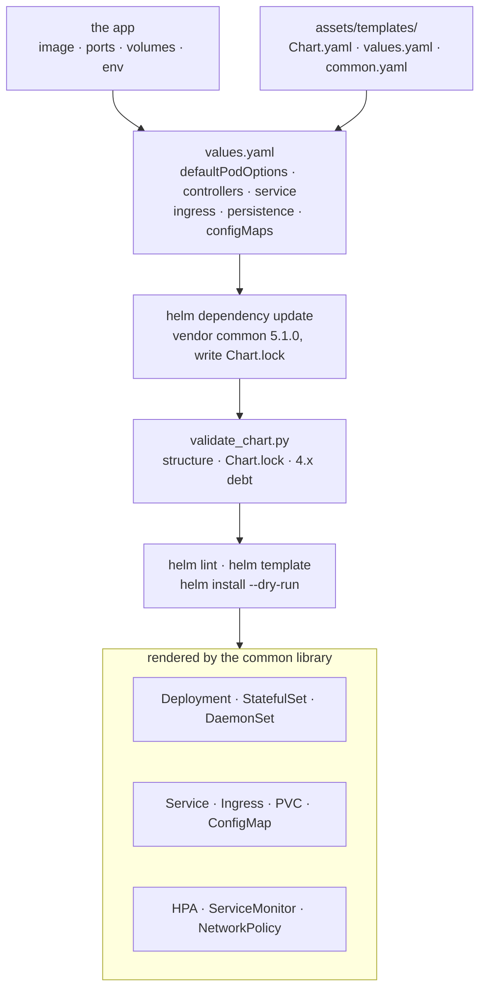

# helm-bjw-s-chart

A Claude Code skill that generates production-ready Helm charts on top of the
[`bjw-s-labs`](https://github.com/bjw-s-labs/helm-charts) common library.
`app-template v5` is the default; `v4` remains a legacy track for clusters
that cannot meet Kubernetes 1.31 / Helm 3.18.

The skill bundles a chart validator, ready-to-fill templates, and reference
patterns covering single-container apps, sidecars, init containers,
StatefulSets, HPAs, NetworkPolicies, and the full 4 to 5 migration.

> **Renamed in v3.0.0.** This skill was published as `helm-chart-generator`
> until v2.x. Anything still pointing at the old name (agent config,
> automation, docs) breaks on the next install or refresh.

---

## 🚀 Features

| Feature | What you get |
|---|---|
| 🎯 **Version matrix** | New charts target `common 5.1.0` (Kubernetes 1.31+, Helm 3.18+). Pin `4.6.2` for legacy clusters and the skill adapts the patterns it emits. |
| 🧭 **Quick-start workflow** | Five steps, from "understand the app" to `helm install --dry-run`, with the decision points spelled out. |
| 📐 **Opinionated `values.yaml`** | One ordering everywhere: `defaultPodOptions`, `controllers`, `service`, `ingress`, `persistence`, `configMaps/secrets`. |
| 🧩 **Pattern library** | Single container, sidecars, init containers, multi-controller, StatefulSets, HPA, PodMonitor, ephemeral volumes, NetworkPolicies with single-controller auto-targeting. The last four are 5.x only. |
| 🔄 **4 to 5 migration** | Five behavioral changes (`automountServiceAccountToken`, default ServiceAccount, `rawResources` shape, `jobLabel`, version bumps) plus the upgrade procedure. |
| ✅ **Static validator** | Flags missing dependencies, a missing `Chart.lock`, unvendored `charts/` tarballs, 4.x migration debt, invalid or inert `strategy` / `rollingUpdate` keys, and the usual structural mistakes. |
| 🆕 **5.1.0 additions** | DaemonSet `updateStrategy`, `automountServiceAccountToken` on the ServiceAccount itself, cross-namespace Routes with an auto-generated `ReferenceGrant`, and the `maxSurge` / `maxUnavailable` spellings that replace `surge` / `unavailable`. |

## 🤔 Why

Bare Helm charts force you to re-implement the same dozen objects every time:
Deployment, Service, Ingress, PVCs, ConfigMaps, Secrets, ServiceAccount, HPA,
NetworkPolicy. The `bjw-s` common library replaces all of that with a
values-only DSL, but its surface is large, and the 4 to 5 migration moves
several defaults out from under existing charts.

This skill folds the library into a single quick-start workflow with
templates, a fixed values-file ordering, and a validator that catches the
most common pitfalls: still pinning 4.x, the legacy `rawResources` `spec:`
shape, an external ServiceAccount without opting out of the default one.

---

## 📦 Installation

The [`skills`](https://skills.sh/) CLI resolves the repo and drops the bundle
into the right agent directory. Run it via `npx`, no global Node install
required.

```bash
# User-global (available in every project)
npx skills add obeone/claude-skills -g --skill helm-bjw-s-chart -y

# Project-scoped (./.claude/skills)
npx skills add obeone/claude-skills --skill helm-bjw-s-chart -y
```

Update with `npx skills update helm-bjw-s-chart`, remove with
`npx skills remove helm-bjw-s-chart`. Full options: `npx skills -h`.

The other install routes (upload in claude.ai, a release bundle by hand, a
source checkout) live in the repository
[Installation](../../README.md#-installation) section.

> **Provenance:** every `.skill` bundle is built in CI by
> [Skill Pack](https://github.com/NimbleBrainInc/skill-pack) from a signed
> release tag, then uploaded by the workflow itself. No asset is ever
> hand-built or hand-uploaded.

### Requirements

| Requirement | Why |
|---|---|
| **Claude Code**, or any agent that reads `SKILL.md` | Runs the skill. |
| **`uv`** on `$PATH` ([install](https://astral.sh/uv/)) | The validator declares its dependencies inline as a [PEP 723](https://peps.python.org/pep-0723/) header, so there is no `pip install` step. |
| **Helm 3.18+ / Kubernetes 1.31+** | Deploys 5.x charts. The 4.x legacy track needs only Helm 3.14 / Kubernetes 1.25. |

---

## ⚙️ Usage

Ask Claude to generate a chart and the skill auto-triggers. The validator is
also a standalone command:

```bash
# Validate a chart against the bjw-s common library expectations
uv run skills/helm-bjw-s-chart/scripts/validate_chart.py ./my-chart/

# JSON output for CI pipelines
uv run skills/helm-bjw-s-chart/scripts/validate_chart.py --json ./my-chart/
```

It warns when the chart still pins `common 4.x`, when `rawResources` uses the
legacy `spec:` shape (removed in 5.x), and when an external ServiceAccount is
referenced without `global.createDefaultServiceAccount: false`.

Once a chart is generated, the usual loop applies:

```bash
cd /path/to/chart
helm dependency update         # fetch common into charts/, write Chart.lock
helm lint .
helm template . --debug
helm install --dry-run --debug my-release .
```

---

## 📚 Deeper documentation

`SKILL.md` is the agent-facing entry point and stays deliberately short: it
sits in the agent's context for the whole session. Everything below is loaded
on demand.

| Reference | Read it when |
|---|---|
| `references/migration-4-to-5.md` | **Start here with an existing 4.x chart.** Five behavioral changes plus the upgrade procedure. |
| `references/patterns.md` | You need a shape: sidecars, init containers, multi-controller, StatefulSets, HPA, PodMonitor, ephemeral volumes, NetworkPolicies. |
| `references/best-practices.md` | You are hardening a chart for production. |
| `references/values-schema.md` | You want the complete `values.yaml` field reference. |

### Layout

| Path | Role |
|---|---|
| `SKILL.md` | Agent entry point: workflow, patterns, 5.x rules |
| `scripts/validate_chart.py` | Structure and bjw-s compatibility validator |
| `assets/templates/` | `Chart.yaml`, `values.yaml`, and common loader starters |
| `references/` | The four deep-dive documents above |

---

## 🏗️ Architecture



---

## 📝 Status

`metadata.version: 5.3.0`. Default library `common 5.1.0`, released
2026-08-16. The 4.x track is maintained, not developed: it gets migration
guidance and validator warnings, not new patterns.

## 📄 License

MIT. See the repository [LICENSE](../../LICENSE).

---

*Built with 🤖 by autonomous agents, for autonomous agents.*

Made by Grégoire Compagnon ([obeone](https://github.com/obeone))
